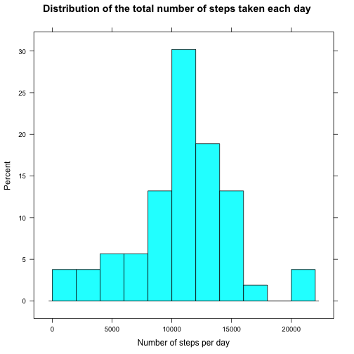

# Reproducible Research: Peer Assessment 1


## Loading and preprocessing the data


```r
data <- read.csv("activity.csv", header = TRUE, colClasses = c("integer", "Date", 
    "integer"))
```


## What is mean total number of steps taken per day?


```r
library(lattice)
steps_per_day <- aggregate(steps ~ date, data, FUN = sum)
histogram(~steps, steps_per_day, breaks = 15, main = "Distribution of the total number of steps taken each day", 
    xlab = "Number of steps per day", ylab = "Percent")
```

 


```r
mean_steps_per_day <- mean(steps_per_day$steps)
median_steps_per_day <- median(steps_per_day$steps)
```


Mean is **1.0766 &times; 10<sup>4</sup>** steps per day. 
Median is **10765** steps per day.

## What is the average daily activity pattern?


```r
steps_across_days <- aggregate(steps ~ interval, data, FUN = mean)
xyplot(steps ~ interval, data = steps_across_days, type = "l", main = "Number of steps per 5 min averaged across days", 
    xlab = "Time of the day", ylab = "Steps")
```

 


```r
max_interval <- steps_across_days$interval[which.max(steps_across_days$steps)]
```


Five minite interval with the maximum number of steps is **835**.

## Imputing missing values


```r
total_na <- sum(is.na(data$steps))
```


The total number of rows with NA is **2304**. 

Missing values are imputed with the average steps for the corresponding interval.


```r
steps_imputed <- apply(data, 1, function(x) if (is.na(as.integer(x[1]))) as.integer(steps_across_days$steps[which(steps_across_days$interval == 
    as.integer(x[3]))]) else as.integer(x[1]))
data_imputed <- cbind(steps_imputed, data[, 2:3])
```


```r
steps_per_day_imputed <- aggregate(steps_imputed ~ date, data_imputed, FUN = sum)
histogram(~steps_imputed, steps_per_day_imputed, breaks = 15, main = "Distribution of the total number of steps taken each day (imputed)", 
    xlab = "Number of steps per day (imputed)", ylab = "Percent")
```

 


```r
mean_steps_per_day_imputed <- mean(steps_per_day_imputed$steps_imputed)
median_steps_per_day_imputed <- median(steps_per_day_imputed$steps_imputed)
```


Mean is **1.0766 &times; 10<sup>4</sup>** steps per day. 
Median is **10765** steps per day.


```r
total_steps_per_day <- sum(steps_per_day$steps)
total_steps_per_day_imputed <- sum(steps_per_day_imputed$steps_imputed)
```


Total daily number of steps is **570608** steps. 
Total daily number of steps after imputation is **655736** steps. 

The imputation has **little impact** on the mean value, even though it **increases** the total value **significantly**.

## Are there differences in activity patterns between weekdays and weekends?


```r
Sys.setlocale("LC_TIME", "C")
```

```
## [1] "C"
```


```r
data <- cbind(data, sapply(data$date, function(x) if (weekdays(x) == "Saturday" | 
    weekdays(x) == "Sunday") "Weekend" else "Weekday"))
names(data)[4] <- "weekend"

xyplot(steps ~ interval | weekend, data = data, layout = c(1, 2), type = "l")
```

 

